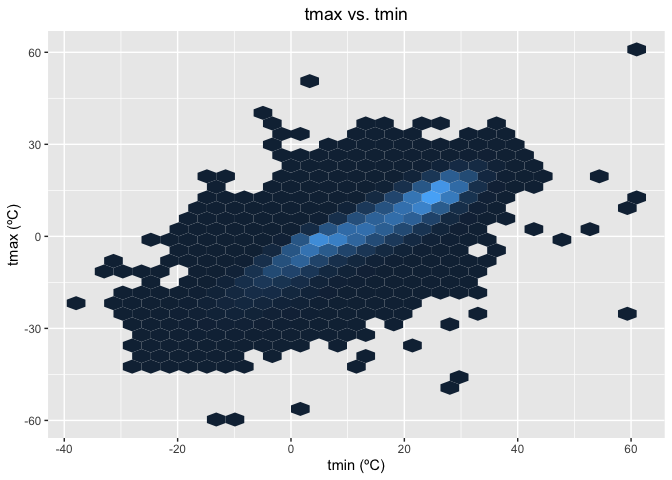

Homework 3
================
Michelle Lee

This is my solution to homework 3.

    library(tidyverse)

    ## ── Attaching packages ────────────────────────────────────────────────────────────────── tidyverse 1.3.0 ──

    ## ✓ ggplot2 3.3.2     ✓ purrr   0.3.4
    ## ✓ tibble  3.0.3     ✓ dplyr   1.0.2
    ## ✓ tidyr   1.1.2     ✓ stringr 1.4.0
    ## ✓ readr   1.3.1     ✓ forcats 0.4.0

    ## ── Conflicts ───────────────────────────────────────────────────────────────────── tidyverse_conflicts() ──
    ## x dplyr::filter() masks stats::filter()
    ## x dplyr::lag()    masks stats::lag()

    library(ggridges)
    library(dplyr)
    library(ggplot2)
    library(p8105.datasets)
    data("instacart")
    names(instacart)

    ##  [1] "order_id"               "product_id"             "add_to_cart_order"     
    ##  [4] "reordered"              "user_id"                "eval_set"              
    ##  [7] "order_number"           "order_dow"              "order_hour_of_day"     
    ## [10] "days_since_prior_order" "product_name"           "aisle_id"              
    ## [13] "department_id"          "aisle"                  "department"

    summary(unique(instacart$department))

    ##    Length     Class      Mode 
    ##        21 character character

    summary(unique(instacart$aisle))

    ##    Length     Class      Mode 
    ##       134 character character

The data, instacart, shows the order details made on instacart. There
are 1384617 rows and 15 variables and some of the key variables are,
order\_id, product\_id, add\_to\_cart\_order,reordered, user\_id,
eval\_set, order\_number, order\_hour\_of\_day,
days\_since\_prior\_order, product\_name, department\_id, department.
Based on the first set of data, we can infer that order id 1 ordered 8
total items, on the 10th hour of the day, 9 days after its previous
order, ordered various items with corresponding aisles, which is in the
training set of the evaluation.

-   How many aisles are there, and which aisles are the most items
    ordered from?

<!-- -->

    #number of aisles;
    ins_aisle= 
    instacart %>%
      count(aisle)
      
    ins_aisle

    ## # A tibble: 134 x 2
    ##    aisle                      n
    ##    <chr>                  <int>
    ##  1 air fresheners candles  1067
    ##  2 asian foods             7007
    ##  3 baby accessories         306
    ##  4 baby bath body care      328
    ##  5 baby food formula      13198
    ##  6 bakery desserts         1501
    ##  7 baking ingredients     13088
    ##  8 baking supplies decor   1094
    ##  9 beauty                   287
    ## 10 beers coolers           1839
    ## # … with 124 more rows

    #finding the mode;
    ins_aisle[order(ins_aisle$n,decreasing=TRUE),]

    ## # A tibble: 134 x 2
    ##    aisle                              n
    ##    <chr>                          <int>
    ##  1 fresh vegetables              150609
    ##  2 fresh fruits                  150473
    ##  3 packaged vegetables fruits     78493
    ##  4 yogurt                         55240
    ##  5 packaged cheese                41699
    ##  6 water seltzer sparkling water  36617
    ##  7 milk                           32644
    ##  8 chips pretzels                 31269
    ##  9 soy lactosefree                26240
    ## 10 bread                          23635
    ## # … with 124 more rows

There are 134 aisles and fresh vegetables (n=150609) is the aisle where
the most itemswere ordered from.

-   Make a plot that shows the number of items ordered in each aisle,
    limiting this to aisles with more than 10000 items ordered. Arrange
    aisles sensibly, and organize your plot so others can read it.

<!-- -->

    ins_aisle2 =
      instacart %>% 
      group_by (aisle, department) %>% 
      summarize(number_products = n()) %>%
      arrange(department)

    ## `summarise()` regrouping output by 'aisle' (override with `.groups` argument)

      ins_aisle2$aisle =
        factor(ins_aisle2$aisle, levels = unique(ins_aisle2 $aisle))
      
      ins_aisle2  %>% 
      ggplot(aes(x = aisle, y = number_products)) + 
      geom_point(aes(color = department)) +
      labs(title = "Products ordered per aisle within departments",
           y = "Products ordered", x = "Aisles") +
      scale_x_discrete(breaks = NULL) +
      theme(plot.title = element_text(hjust = 0.5))

<!-- --> - Make a table
showing the three most popular items in each of the aisles “baking
ingredients”, “dog food care”, and “packaged vegetables fruits”. Include
the number of times each item is ordered in your table.

    #create a subset;
    popular_items <-
     instacart[which(instacart$aisle == "baking ingredients" |
                    instacart$aisle == "dog food care" |
                    instacart$aisle == "packaged vegetables fruits"),]

    #drop other columns and find frequency of each product;
    popular_items=
      select(popular_items, aisle, product_name) %>%
      count(aisle,product_name) 

    #sort in decreasing order;
    popular_items= 
      popular_items[order(popular_items$n,decreasing=TRUE),]

    #create a table;
    require(data.table)

    ## Loading required package: data.table

    ## 
    ## Attaching package: 'data.table'

    ## The following objects are masked from 'package:dplyr':
    ## 
    ##     between, first, last

    ## The following object is masked from 'package:purrr':
    ## 
    ##     transpose

    popular_items_top3 =
      data.table(popular_items, key = "aisle")

    popular_items_top3=
      popular_items_top3[,head(.SD,3), by=aisle]
    knitr::kable(popular_items_top3)

| aisle                      | product\_name                                 |    n |
|:---------------------------|:----------------------------------------------|-----:|
| baking ingredients         | Light Brown Sugar                             |  499 |
| baking ingredients         | Pure Baking Soda                              |  387 |
| baking ingredients         | Cane Sugar                                    |  336 |
| dog food care              | Snack Sticks Chicken & Rice Recipe Dog Treats |   30 |
| dog food care              | Organix Chicken & Brown Rice Recipe           |   28 |
| dog food care              | Small Dog Biscuits                            |   26 |
| packaged vegetables fruits | Organic Baby Spinach                          | 9784 |
| packaged vegetables fruits | Organic Raspberries                           | 5546 |
| packaged vegetables fruits | Organic Blueberries                           | 4966 |

Make a table showing the mean hour of the day at which Pink Lady Apples
and Coffee Ice Cream are ordered on each day of the week; format this
table for human readers (i.e. produce a 2 x 7 table).

    pla_cic <-
     instacart[which(instacart$product_name == "Pink Lady Apples" |
                    instacart$product_name == "Coffee Ice Cream"),]
    pla_cic

    ## # A tibble: 430 x 15
    ##    order_id product_id add_to_cart_ord… reordered user_id eval_set order_number
    ##       <int>      <int>            <int>     <int>   <int> <chr>           <int>
    ##  1     1342       3798                6         1  156818 train              32
    ##  2    13887      17334                4         1  159168 train               5
    ##  3    32022       3798                3         1   14916 train              46
    ##  4    33963      17334               10         1  180434 train              54
    ##  5    61005       3798                4         1   76283 train              17
    ##  6    63239       3798                6         0   96911 train               5
    ##  7    66981      17334               18         1   27257 train               9
    ##  8    67536       3798                1         1  162096 train               5
    ##  9    76470       3798                5         1  180560 train              61
    ## 10    82073       3798                2         1   76641 train              20
    ## # … with 420 more rows, and 8 more variables: order_dow <int>,
    ## #   order_hour_of_day <int>, days_since_prior_order <int>, product_name <chr>,
    ## #   aisle_id <int>, department_id <int>, aisle <chr>, department <chr>

    #drop other columns;
    pla_cic =
    select(pla_cic , order_hour_of_day, order_dow, product_name)
    pla_cic

    ## # A tibble: 430 x 3
    ##    order_hour_of_day order_dow product_name    
    ##                <int>     <int> <chr>           
    ##  1                 8         3 Pink Lady Apples
    ##  2                17         2 Coffee Ice Cream
    ##  3                13         1 Pink Lady Apples
    ##  4                 9         6 Coffee Ice Cream
    ##  5                 9         2 Pink Lady Apples
    ##  6                 7         4 Pink Lady Apples
    ##  7                 1         6 Coffee Ice Cream
    ##  8                10         2 Pink Lady Apples
    ##  9                 9         1 Pink Lady Apples
    ## 10                 9         1 Pink Lady Apples
    ## # … with 420 more rows

    #group by each dow;
    require(data.table)
    by_dow = 
      pla_cic %>%
      group_by (order_dow, product_name)
    by_dow =
      by_dow %>% summarise(
      mean_hours = round(mean(order_hour_of_day))
      )

    ## `summarise()` regrouping output by 'order_dow' (override with `.groups` argument)

    knitr::kable(by_dow)

| order\_dow | product\_name    | mean\_hours |
|-----------:|:-----------------|------------:|
|          0 | Coffee Ice Cream |          14 |
|          0 | Pink Lady Apples |          13 |
|          1 | Coffee Ice Cream |          14 |
|          1 | Pink Lady Apples |          11 |
|          2 | Coffee Ice Cream |          15 |
|          2 | Pink Lady Apples |          12 |
|          3 | Coffee Ice Cream |          15 |
|          3 | Pink Lady Apples |          14 |
|          4 | Coffee Ice Cream |          15 |
|          4 | Pink Lady Apples |          12 |
|          5 | Coffee Ice Cream |          12 |
|          5 | Pink Lady Apples |          13 |
|          6 | Coffee Ice Cream |          14 |
|          6 | Pink Lady Apples |          12 |

\#problem 2 Load, tidy, and otherwise wrangle the data. Your final
dataset should include all originally observed variables and values;
have useful variable names; include a weekday vs weekend variable; and
encode data with reasonable variable classes. Describe the resulting
dataset (e.g. what variables exist, how many observations, etc).

    #import csv
    acc_data = read_csv("./accel_data.csv")

    ## Parsed with column specification:
    ## cols(
    ##   .default = col_double(),
    ##   day = col_character()
    ## )

    ## See spec(...) for full column specifications.

    acc_data_clean = janitor::clean_names(acc_data)
    acc_data_clean

    ## # A tibble: 35 x 1,443
    ##     week day_id day   activity_1 activity_2 activity_3 activity_4 activity_5
    ##    <dbl>  <dbl> <chr>      <dbl>      <dbl>      <dbl>      <dbl>      <dbl>
    ##  1     1      1 Frid…       88.4       82.2       64.4       70.0       75.0
    ##  2     1      2 Mond…        1          1          1          1          1  
    ##  3     1      3 Satu…        1          1          1          1          1  
    ##  4     1      4 Sund…        1          1          1          1          1  
    ##  5     1      5 Thur…       47.4       48.8       46.9       35.8       49.0
    ##  6     1      6 Tues…       64.8       59.5       73.7       45.7       42.4
    ##  7     1      7 Wedn…       71.1      103.        68.5       45.4       37.8
    ##  8     2      8 Frid…      675        542       1010        779        509  
    ##  9     2      9 Mond…      291        335        393        335        263  
    ## 10     2     10 Satu…       64         11          1          1          1  
    ## # … with 25 more rows, and 1,435 more variables: activity_6 <dbl>,
    ## #   activity_7 <dbl>, activity_8 <dbl>, activity_9 <dbl>, activity_10 <dbl>,
    ## #   activity_11 <dbl>, activity_12 <dbl>, activity_13 <dbl>, activity_14 <dbl>,
    ## #   activity_15 <dbl>, activity_16 <dbl>, activity_17 <dbl>, activity_18 <dbl>,
    ## #   activity_19 <dbl>, activity_20 <dbl>, activity_21 <dbl>, activity_22 <dbl>,
    ## #   activity_23 <dbl>, activity_24 <dbl>, activity_25 <dbl>, activity_26 <dbl>,
    ## #   activity_27 <dbl>, activity_28 <dbl>, activity_29 <dbl>, activity_30 <dbl>,
    ## #   activity_31 <dbl>, activity_32 <dbl>, activity_33 <dbl>, activity_34 <dbl>,
    ## #   activity_35 <dbl>, activity_36 <dbl>, activity_37 <dbl>, activity_38 <dbl>,
    ## #   activity_39 <dbl>, activity_40 <dbl>, activity_41 <dbl>, activity_42 <dbl>,
    ## #   activity_43 <dbl>, activity_44 <dbl>, activity_45 <dbl>, activity_46 <dbl>,
    ## #   activity_47 <dbl>, activity_48 <dbl>, activity_49 <dbl>, activity_50 <dbl>,
    ## #   activity_51 <dbl>, activity_52 <dbl>, activity_53 <dbl>, activity_54 <dbl>,
    ## #   activity_55 <dbl>, activity_56 <dbl>, activity_57 <dbl>, activity_58 <dbl>,
    ## #   activity_59 <dbl>, activity_60 <dbl>, activity_61 <dbl>, activity_62 <dbl>,
    ## #   activity_63 <dbl>, activity_64 <dbl>, activity_65 <dbl>, activity_66 <dbl>,
    ## #   activity_67 <dbl>, activity_68 <dbl>, activity_69 <dbl>, activity_70 <dbl>,
    ## #   activity_71 <dbl>, activity_72 <dbl>, activity_73 <dbl>, activity_74 <dbl>,
    ## #   activity_75 <dbl>, activity_76 <dbl>, activity_77 <dbl>, activity_78 <dbl>,
    ## #   activity_79 <dbl>, activity_80 <dbl>, activity_81 <dbl>, activity_82 <dbl>,
    ## #   activity_83 <dbl>, activity_84 <dbl>, activity_85 <dbl>, activity_86 <dbl>,
    ## #   activity_87 <dbl>, activity_88 <dbl>, activity_89 <dbl>, activity_90 <dbl>,
    ## #   activity_91 <dbl>, activity_92 <dbl>, activity_93 <dbl>, activity_94 <dbl>,
    ## #   activity_95 <dbl>, activity_96 <dbl>, activity_97 <dbl>, activity_98 <dbl>,
    ## #   activity_99 <dbl>, activity_100 <dbl>, activity_101 <dbl>,
    ## #   activity_102 <dbl>, activity_103 <dbl>, activity_104 <dbl>,
    ## #   activity_105 <dbl>, …

    acc_data_clean =
      pivot_longer(
        acc_data_clean,
        activity_1:activity_1440,
        names_to = "minute",
        values_to= "activity_counts")

    acc_data_clean =
      acc_data_clean %>%
      mutate(weekday_weekend = day) %>%
      mutate(weekday_weekend = recode(weekday_weekend, 
                                      'Monday' = 'weekday',
                                      'Tuesday' = 'weekday',
                                      'Wednesday' = 'weekday',
                                      'Thursday' = 'weekday',
                                      'Friday' = 'weekday',
                                      'Saturday' = 'weekdend',
                                      'Sunday' = 'weekend'
                                      )) 
    acc_data_clean$day <-
      factor(acc_data_clean$day, levels= c("Monday", "Tuesday", "Wednesday", "Thursday", "Friday", "Saturday","Sunday"))

    acc_data_clean[order(acc_data_clean$day), ]

    ## # A tibble: 50,400 x 6
    ##     week day_id day    minute      activity_counts weekday_weekend
    ##    <dbl>  <dbl> <fct>  <chr>                 <dbl> <chr>          
    ##  1     1      2 Monday activity_1                1 weekday        
    ##  2     1      2 Monday activity_2                1 weekday        
    ##  3     1      2 Monday activity_3                1 weekday        
    ##  4     1      2 Monday activity_4                1 weekday        
    ##  5     1      2 Monday activity_5                1 weekday        
    ##  6     1      2 Monday activity_6                1 weekday        
    ##  7     1      2 Monday activity_7                1 weekday        
    ##  8     1      2 Monday activity_8                1 weekday        
    ##  9     1      2 Monday activity_9                1 weekday        
    ## 10     1      2 Monday activity_10               1 weekday        
    ## # … with 50,390 more rows

    view(acc_data_clean)
    summary(acc_data_clean)

    ##       week       day_id          day          minute          activity_counts
    ##  Min.   :1   Min.   : 1   Monday   :7200   Length:50400       Min.   :   1   
    ##  1st Qu.:2   1st Qu.: 9   Tuesday  :7200   Class :character   1st Qu.:   1   
    ##  Median :3   Median :18   Wednesday:7200   Mode  :character   Median :  74   
    ##  Mean   :3   Mean   :18   Thursday :7200                      Mean   : 267   
    ##  3rd Qu.:4   3rd Qu.:27   Friday   :7200                      3rd Qu.: 364   
    ##  Max.   :5   Max.   :35   Saturday :7200                      Max.   :8982   
    ##                           Sunday   :7200                                     
    ##  weekday_weekend   
    ##  Length:50400      
    ##  Class :character  
    ##  Mode  :character  
    ##                    
    ##                    
    ##                    
    ## 

Data description: This dataset contains information regarding five weeks
of accelerometer data collected on a 63 year-old male with BMI 25.
(After pivoting,) The dataset contains a total of 50400 observations and
6 variables, including new variables, activity\_counts, minute, and
weekday vs weekend. There is no missing data. “activity\_counts” is the
activity count for a given mintue in the observation.

Traditional analyses of accelerometer data focus on the total activity
over the day. Using your tidied dataset, aggregate accross minutes to
create a total activity variable for each day, and create a table
showing these totals. Are any trends apparent?

    total_activity =
    acc_data_clean %>%
        group_by(week,day) %>%
        summarise(
          total_activity = sum(activity_counts)
        ) %>%
      pivot_wider(
        names_from = "day",
        values_from = "total_activity"
      ) 

    ## `summarise()` regrouping output by 'week' (override with `.groups` argument)

    knitr::kable(total_activity)

| week |    Monday |  Tuesday | Wednesday | Thursday |   Friday | Saturday | Sunday |
|-----:|----------:|---------:|----------:|---------:|---------:|---------:|-------:|
|    1 |  78828.07 | 307094.2 |    340115 | 355923.6 | 480542.6 |   376254 | 631105 |
|    2 | 295431.00 | 423245.0 |    440962 | 474048.0 | 568839.0 |   607175 | 422018 |
|    3 | 685910.00 | 381507.0 |    468869 | 371230.0 | 467420.0 |   382928 | 467052 |
|    4 | 409450.00 | 319568.0 |    434460 | 340291.0 | 154049.0 |     1440 | 260617 |
|    5 | 389080.00 | 367824.0 |    445366 | 549658.0 | 620860.0 |     1440 | 138421 |

Based on the table above, it is difficult to identify any clear trends
betwen total activity variable for each day.Generally, this person had a
consistent total activity between 340115\~ 468869 on Wednesdays. On
Saturday of week 4 and 5, this person had low activity counts compared
to other days.

Accelerometer data allows the inspection activity over the course of the
day. Make a single-panel plot that shows the 24-hour activity time
courses for each day and use color to indicate day of the week. Describe
in words any patterns or conclusions you can make based on this graph.

    acc_data_clean %>%
        ggplot(aes(x = minute, y = activity_counts,group=day)) + 
      geom_line(aes(color = day)) +
      labs(title = "24 hour activity time courses over 5 weeks", 
           x = "Hours", 
           y = "Activity Counts") 

<!-- -->
\#problem 3

    library(p8105.datasets)
    data("ny_noaa")
    ny_noaa= 
      ny_noaa[order(ny_noaa$date,decreasing=FALSE),]
    ny_noaa[order(ny_noaa$date,decreasing=TRUE),]

    ## # A tibble: 2,595,176 x 7
    ##    id          date        prcp  snow  snwd tmax  tmin 
    ##    <chr>       <date>     <int> <int> <int> <chr> <chr>
    ##  1 US1NYAB0001 2010-12-31     0     0    NA <NA>  <NA> 
    ##  2 US1NYAB0006 2010-12-31     0     0    76 <NA>  <NA> 
    ##  3 US1NYAB0010 2010-12-31    NA    NA    NA <NA>  <NA> 
    ##  4 US1NYAB0017 2010-12-31    NA    NA    NA <NA>  <NA> 
    ##  5 US1NYAB0021 2010-12-31     0     0   127 <NA>  <NA> 
    ##  6 US1NYAB0022 2010-12-31    NA    NA    NA <NA>  <NA> 
    ##  7 US1NYAB0023 2010-12-31     0     0   178 <NA>  <NA> 
    ##  8 US1NYAB0025 2010-12-31     0     0   152 <NA>  <NA> 
    ##  9 US1NYAL0002 2010-12-31     0     0    64 <NA>  <NA> 
    ## 10 US1NYBM0001 2010-12-31     0     0    25 <NA>  <NA> 
    ## # … with 2,595,166 more rows

    ny_noaa

    ## # A tibble: 2,595,176 x 7
    ##    id          date        prcp  snow  snwd tmax  tmin 
    ##    <chr>       <date>     <int> <int> <int> <chr> <chr>
    ##  1 USC00300023 1981-01-01     0     0     0 -56   <NA> 
    ##  2 USC00300055 1981-01-01     0     0    76 -50   -128 
    ##  3 USC00300063 1981-01-01     0    NA    NA -83   -150 
    ##  4 USC00300085 1981-01-01     3     3   102 -44   -139 
    ##  5 USC00300093 1981-01-01     0    NA   102 -39   -128 
    ##  6 USC00300183 1981-01-01     0     0    76 -33   -117 
    ##  7 USC00300220 1981-01-01     0     0   203 -39   -122 
    ##  8 USC00300254 1981-01-01     0     0    NA <NA>  <NA> 
    ##  9 USC00300331 1981-01-01     0     0    51 -72   -144 
    ## 10 USC00300343 1981-01-01     0     0   127 <NA>  <NA> 
    ## # … with 2,595,166 more rows

    unique(ny_noaa$id)

    ##   [1] "USC00300023" "USC00300055" "USC00300063" "USC00300085" "USC00300093"
    ##   [6] "USC00300183" "USC00300220" "USC00300254" "USC00300331" "USC00300343"
    ##  [11] "USC00300379" "USC00300424" "USC00300443" "USC00300448" "USC00300452"
    ##  [16] "USC00300500" "USC00300505" "USC00300608" "USC00300613" "USC00300641"
    ##  [21] "USC00300654" "USC00300668" "USC00300766" "USC00300785" "USC00300817"
    ##  [26] "USC00300870" "USC00300889" "USC00300929" "USC00300937" "USC00301095"
    ##  [31] "USC00301103" "USC00301110" "USC00301136" "USC00301152" "USC00301160"
    ##  [36] "USC00301168" "USC00301173" "USC00301265" "USC00301387" "USC00301401"
    ##  [41] "USC00301413" "USC00301424" "USC00301436" "USC00301492" "USC00301521"
    ##  [46] "USC00301580" "USC00301593" "USC00301623" "USC00301664" "USC00301708"
    ##  [51] "USC00301723" "USC00301752" "USC00301792" "USC00301799" "USC00301966"
    ##  [56] "USC00301974" "USC00302060" "USC00302079" "USC00302129" "USC00302137"
    ##  [61] "USC00302169" "USC00302236" "USC00302277" "USC00302554" "USC00302574"
    ##  [66] "USC00302582" "USC00302599" "USC00302610" "USC00302720" "USC00302934"
    ##  [71] "USC00303010" "USC00303025" "USC00303033" "USC00303050" "USC00303065"
    ##  [76] "USC00303076" "USC00303124" "USC00303138" "USC00303144" "USC00303184"
    ##  [81] "USC00303259" "USC00303284" "USC00303319" "USC00303346" "USC00303352"
    ##  [86] "USC00303354" "USC00303360" "USC00303365" "USC00303444" "USC00303464"
    ##  [91] "USC00303722" "USC00303766" "USC00303773" "USC00303851" "USC00303889"
    ##  [96] "USC00303961" "USC00303970" "USC00303983" "USC00304025" "USC00304102"
    ## [101] "USC00304174" "USC00304207" "USC00304473" "USC00304525" "USC00304555"
    ## [106] "USC00304647" "USC00304731" "USC00304772" "USC00304791" "USC00304796"
    ## [111] "USC00304808" "USC00304836" "USC00304844" "USC00304849" "USC00304912"
    ## [116] "USC00304944" "USC00305032" "USC00305171" "USC00305248" "USC00305276"
    ## [121] "USC00305310" "USC00305334" "USC00305377" "USC00305426" "USC00305512"
    ## [126] "USC00305597" "USC00305635" "USC00305639" "USC00305673" "USC00305679"
    ## [131] "USC00305687" "USC00305714" "USC00305743" "USC00305751" "USC00305759"
    ## [136] "USC00305796" "USC00305804" "USC00305821" "USC00305869" "USC00306062"
    ## [141] "USC00306164" "USC00306184" "USC00306196" "USC00306232" "USC00306314"
    ## [146] "USC00306356" "USC00306411" "USC00306441" "USC00306464" "USC00306510"
    ## [151] "USC00306538" "USC00306567" "USC00306623" "USC00306659" "USC00306674"
    ## [156] "USC00306745" "USC00306774" "USC00306831" "USC00306839" "USC00306957"
    ## [161] "USC00307129" "USC00307134" "USC00307195" "USC00307210" "USC00307274"
    ## [166] "USC00307329" "USC00307405" "USC00307484" "USC00307497" "USC00307633"
    ## [171] "USC00307705" "USC00307713" "USC00307721" "USC00307772" "USC00307780"
    ## [176] "USC00307799" "USC00307842" "USC00308058" "USC00308088" "USC00308160"
    ## [181] "USC00308248" "USC00308322" "USC00308578" "USC00308586" "USC00308594"
    ## [186] "USC00308600" "USC00308625" "USC00308627" "USC00308631" "USC00308670"
    ## [191] "USC00308739" "USC00308746" "USC00308773" "USC00308833" "USC00308906"
    ## [196] "USC00308936" "USC00308944" "USC00308946" "USC00308962" "USC00308987"
    ## [201] "USC00309000" "USC00309055" "USC00309072" "USC00309076" "USC00309117"
    ## [206] "USC00309189" "USC00309250" "USC00309292" "USC00309303" "USC00309307"
    ## [211] "USC00309389" "USC00309425" "USC00309437" "USC00309507" "USC00309516"
    ## [216] "USC00309533" "USC00309544" "USC00309670" "USW00004725" "USW00004781"
    ## [221] "USW00004782" "USW00014717" "USW00014732" "USW00014733" "USW00014735"
    ## [226] "USW00014743" "USW00014750" "USW00014757" "USW00014768" "USW00014771"
    ## [231] "USW00094725" "USW00094728" "USW00094745" "USW00094789" "USW00094790"
    ## [236] "USW00094794" "USC00301207" "USC00302829" "USC00306085" "USC00302036"
    ## [241] "USC00305925" "USC00309125" "USC00307818" "USC00308959" "USC00306047"
    ## [246] "USC00304996" "USC00303152" "USC00300360" "USC00305113" "USC00300658"
    ## [251] "USC00306517" "USC00306867" "USC00300321" "USC00305769" "USC00308839"
    ## [256] "USC00302366" "USC00302627" "USC00304575" "USC00307750" "USC00300028"
    ## [261] "USC00308910" "USC00301794" "USC00306965" "USC00302091" "USC00301595"
    ## [266] "USC00304717" "USC00304952" "USC00305255" "USC00306833" "USC00301761"
    ## [271] "USC00307514" "USC00309047" "USC00305840" "USC00301787" "USC00309270"
    ## [276] "USC00307035" "USC00308304" "USC00307400" "USC00302686" "USC00308742"
    ## [281] "USC00309495" "USC00306527" "USC00303955" "USC00306820" "USC00305380"
    ## [286] "USC00306138" "USC00307587" "USW00054773" "USC00308932" "USW00014747"
    ## [291] "USC00308086" "USC00303769" "USW00004789" "USW00014748" "USW00054778"
    ## [296] "USC00305438" "US1NYCM0004" "US1NYCM0006" "US1NYCM0010" "US1NYCR0005"
    ## [301] "US1NYER0013" "US1NYER0060" "US1NYER0079" "US1NYHM0005" "US1NYJF0019"
    ## [306] "US1NYNG0011" "US1NYOS0001" "US1NYOS0013" "US1NYSC0011" "US1NYST0004"
    ## [311] "US1NYST0024" "US1NYSY0005" "US1NYSY0009" "US1NYTG0008" "US1NYTM0003"
    ## [316] "US1NYWN0010" "USC00308080" "USW00094740" "USW00014719" "USW00094733"
    ## [321] "USC00306649" "US1NYOT0009" "USW00054780" "USC00300048" "USW00054787"
    ## [326] "USW00054790" "USW00054757" "USW00094704" "USC00302047" "USC00308317"
    ## [331] "US1NYBM0007" "US1NYES0005" "US1NYMR0015" "USC00302286" "US1NYSF0030"
    ## [336] "USC00306376" "USC00300961" "USC00308386" "USW00004724" "US1NYSR0014"
    ## [341] "US1NYTM0005" "USC00301732" "USC00309480" "USR0000NSAR" "USC00305233"
    ## [346] "USC00301309" "USR0000NGAN" "USR0000NSCH" "USR0000NSHR" "USR0000NSTO"
    ## [351] "USC00303590" "USC00300910" "USC00301211" "USC00306525" "US1NYBM0004"
    ## [356] "US1NYBM0011" "US1NYCM0003" "US1NYCM0005" "US1NYCN0002" "US1NYCN0003"
    ## [361] "US1NYCR0003" "US1NYCY0001" "US1NYCY0002" "US1NYCY0003" "US1NYDL0004"
    ## [366] "US1NYOD0002" "US1NYOD0006" "US1NYOD0007" "US1NYOG0002" "US1NYOG0003"
    ## [371] "US1NYOG0004" "US1NYOG0008" "US1NYOT0001" "US1NYSN0002" "US1NYST0009"
    ## [376] "US1NYST0011" "US1NYST0013" "US1NYST0014" "US1NYSV0001" "US1NYTG0003"
    ## [381] "US1NYYT0001" "US1NYCM0008" "US1NYMD0001" "US1NYSV0003" "US1NYCM0007"
    ## [386] "US1NYBM0006" "US1NYOD0004" "US1NYOD0008" "US1NYST0006" "USC00302454"
    ## [391] "USC00309442" "US1NYOG0005" "USC00309690" "US1NYOD0009" "US1NYOG0011"
    ## [396] "USC00307260" "USC00304939" "USW00064758" "USW00064756" "US1NYOG0014"
    ## [401] "US1NYOG0010" "US1NYTM0006" "USC00301625" "US1NYOD0001" "US1NYOG0013"
    ## [406] "US1NYST0005" "US1NYSV0004" "US1NYTG0002" "US1NYTG0004" "USC00302031"
    ## [411] "US1NYDL0001" "US1NYDL0006" "US1NYDL0008" "US1NYDL0009" "US1NYMD0008"
    ## [416] "US1NYOD0005" "US1NYOT0002" "US1NYOT0003" "US1NYTM0007" "US1NYDL0003"
    ## [421] "US1NYOG0015" "US1NYDL0005" "US1NYOG0016" "US1NYSV0005" "US1NYTG0009"
    ## [426] "USC00305180" "US1NYCR0001" "US1NYTM0008" "US1NYOD0003" "US1NYTG0007"
    ## [431] "US1NYBM0010" "US1NYMD0009" "US1NYDL0011" "US1NYSF0049" "US1NYHR0006"
    ## [436] "USW00064775" "USW00064776" "US1NYBM0001" "US1NYCB0001" "US1NYTM0001"
    ## [441] "US1NYBM0014" "US1NYCM0002" "US1NYER0001" "US1NYER0002" "US1NYER0003"
    ## [446] "US1NYMD0002" "US1NYMD0005" "US1NYMD0010" "US1NYOG0006" "US1NYOG0012"
    ## [451] "US1NYSC0001" "US1NYSR0002" "US1NYST0002" "US1NYSV0006" "US1NYTM0004"
    ## [456] "US1NYCY0004" "US1NYDT0001" "US1NYGN0001" "US1NYMD0011" "US1NYNG0002"
    ## [461] "US1NYOS0003" "US1NYRN0001" "US1NYSH0001" "US1NYAB0001" "US1NYBM0002"
    ## [466] "US1NYHM0001" "US1NYHR0001" "US1NYLV0001" "US1NYLW0001" "US1NYMR0002"
    ## [471] "US1NYNG0003" "US1NYNS0001" "US1NYOD0011" "US1NYOD0014" "US1NYOR0002"
    ## [476] "US1NYOT0004" "US1NYOT0005" "US1NYOT0008" "US1NYSF0002" "US1NYSF0003"
    ## [481] "US1NYSF0007" "US1NYST0003" "US1NYST0016" "US1NYSY0001" "US1NYTG0005"
    ## [486] "US1NYTM0002" "US1NYUL0001" "US1NYUL0002" "US1NYMR0004" "US1NYOR0003"
    ## [491] "US1NYRL0001" "US1NYCN0006" "US1NYCT0002" "US1NYST0012" "US1NYST0023"
    ## [496] "US1NYWC0003" "US1NYCM0012" "US1NYER0006" "US1NYJF0004" "US1NYUL0003"
    ## [501] "US1NYDL0016" "US1NYPT0001" "US1NYST0019" "US1NYTM0015" "US1NYJF0003"
    ## [506] "US1NYMR0005" "US1NYPT0002" "US1NYSN0006" "US1NYSR0004" "US1NYTM0010"
    ## [511] "US1NYTM0012" "US1NYTM0014" "US1NYTM0016" "US1NYTM0017" "US1NYTM0018"
    ## [516] "US1NYTM0019" "US1NYTM0021" "US1NYER0007" "US1NYMR0008" "US1NYOG0020"
    ## [521] "US1NYST0010" "US1NYST0026" "US1NYHR0004" "US1NYMR0001" "US1NYOL0001"
    ## [526] "US1NYSL0003" "US1NYTM0022" "US1NYYT0003" "US1NYBM0019" "US1NYER0008"
    ## [531] "US1NYER0009" "US1NYER0010" "US1NYER0012" "US1NYER0026" "US1NYER0029"
    ## [536] "US1NYER0035" "US1NYER0039" "US1NYER0044" "US1NYNG0006" "US1NYNG0008"
    ## [541] "US1NYOS0006" "US1NYSV0007" "US1NYER0015" "US1NYER0025" "US1NYER0040"
    ## [546] "US1NYER0045" "US1NYER0046" "US1NYJF0005" "US1NYLW0002" "US1NYSF0016"
    ## [551] "US1NYTG0015" "US1NYAB0006" "US1NYCT0005" "US1NYCT0006" "US1NYCT0007"
    ## [556] "US1NYCY0008" "US1NYES0001" "US1NYJF0013" "US1NYMG0002" "US1NYOD0017"
    ## [561] "US1NYOD0019" "US1NYOG0025" "US1NYOG0028" "US1NYOG0031" "US1NYOS0008"
    ## [566] "US1NYOT0011" "US1NYSC0002" "US1NYSL0002" "US1NYSL0006" "US1NYSR0006"
    ## [571] "US1NYSR0008" "US1NYSY0002" "US1NYTM0023" "US1NYTM0024" "US1NYTM0026"
    ## [576] "US1NYUL0004" "US1NYWN0003" "US1NYWN0004" "US1NYWR0003" "US1NYWR0004"
    ## [581] "US1NYWY0002" "USC00309248" "US1NYAB0010" "US1NYCY0009" "US1NYFK0002"
    ## [586] "US1NYJF0007" "US1NYJF0008" "US1NYJF0010" "US1NYNS0006" "US1NYNS0007"
    ## [591] "US1NYOD0016" "US1NYOG0026" "US1NYOG0030" "US1NYTM0025" "US1NYTM0027"
    ## [596] "US1NYCL0002" "US1NYCT0003" "US1NYDT0002" "US1NYER0050" "US1NYJF0011"
    ## [601] "US1NYKN0003" "US1NYMG0001" "US1NYPT0004" "US1NYTM0028" "USC00300732"
    ## [606] "US1NYCY0005" "US1NYCY0010" "US1NYSR0011" "US1NYBM0021" "US1NYSF0017"
    ## [611] "US1NYSF0018" "US1NYSL0008" "US1NYCL0005" "US1NYCN0008" "USC00300317"
    ## [616] "US1NYDL0017" "US1NYMR0007" "US1NYMR0012" "US1NYWN0006" "US1NYCL0007"
    ## [621] "US1NYCM0013" "US1NYCQ0005" "US1NYMR0016" "US1NYOL0002" "US1NYSY0003"
    ## [626] "US1NYWN0007" "USC00302953" "US1NYCT0010" "US1NYCT0012" "US1NYCY0013"
    ## [631] "US1NYER0053" "US1NYLW0003" "US1NYMR0018" "US1NYMR0020" "US1NYMR0021"
    ## [636] "US1NYMR0023" "US1NYNG0010" "US1NYOD0023" "US1NYON0004" "US1NYSL0009"
    ## [641] "US1NYSR0013" "USC00301702" "US1NYAB0016" "US1NYCQ0007" "US1NYER0024"
    ## [646] "US1NYER0054" "US1NYMR0024" "US1NYOD0026" "US1NYOS0015" "US1NYRL0003"
    ## [651] "US1NYSF0019" "US1NYSR0007" "US1NYWN0009" "US1NYAB0017" "US1NYAL0002"
    ## [656] "US1NYCN0009" "US1NYER0057" "US1NYNG0012" "US1NYNS0009" "US1NYRC0001"
    ## [661] "US1NYER0077" "US1NYWC0005" "USC00302197" "US1NYCM0014" "US1NYCT0014"
    ## [666] "US1NYER0058" "US1NYOG0037" "US1NYOR0006" "US1NYSL0010" "US1NYSR0015"
    ## [671] "US1NYTG0017" "US1NYTG0018" "USC00303087" "US1NYCL0008" "US1NYCT0011"
    ## [676] "US1NYER0059" "US1NYER0063" "US1NYER0065" "US1NYER0066" "US1NYER0068"
    ## [681] "US1NYHM0002" "US1NYHR0009" "US1NYJF0020" "US1NYOG0038" "US1NYOL0003"
    ## [686] "US1NYST0028" "US1NYER0004" "US1NYER0051" "US1NYGR0005" "US1NYMR0029"
    ## [691] "US1NYOT0013" "US1NYOT0014" "US1NYOT0015" "US1NYSR0016" "US1NYCQ0006"
    ## [696] "US1NYCY0014" "US1NYER0067" "US1NYLW0005" "US1NYMR0026" "US1NYWC0006"
    ## [701] "USC00309049" "US1NYAB0021" "US1NYAB0022" "US1NYAB0023" "US1NYAB0025"
    ## [706] "US1NYER0072" "US1NYOS0020" "US1NYWC0007" "US1NYDT0004" "US1NYLV0002"
    ## [711] "US1NYNG0017" "US1NYRL0004" "USC00306217" "US1NYER0075" "US1NYRN0002"
    ## [716] "US1NYSY0006" "US1NYSY0007" "US1NYSY0008" "US1NYCR0008" "US1NYHR0010"
    ## [721] "US1NYLV0005" "US1NYOS0021" "US1NYSY0010" "US1NYSY0011" "US1NYSY0012"
    ## [726] "US1NYUL0008" "US1NYDT0007" "US1NYST0033" "US1NYCQ0010" "US1NYER0080"
    ## [731] "US1NYOG0040" "US1NYMR0032" "US1NYER0081" "US1NYUL0006" "US1NYUL0009"
    ## [736] "US1NYER0083" "US1NYST0029" "US1NYST0030" "US1NYDT0005" "US1NYOG0043"
    ## [741] "US1NYOR0004" "US1NYTM0030" "US1NYCN0011" "US1NYCQ0012" "US1NYER0085"
    ## [746] "US1NYMD0014" "US1NYWC0009"

    summary(is.na(ny_noaa))

    ##      id             date            prcp            snow        
    ##  Mode :logical   Mode :logical   Mode :logical   Mode :logical  
    ##  FALSE:2595176   FALSE:2595176   FALSE:2449338   FALSE:2213955  
    ##                                  TRUE :145838    TRUE :381221   
    ##     snwd            tmax            tmin        
    ##  Mode :logical   Mode :logical   Mode :logical  
    ##  FALSE:2003390   FALSE:1460818   FALSE:1460756  
    ##  TRUE :591786    TRUE :1134358   TRUE :1134420

Description of the dataset: There is a total of 2,595,176 total
observations(rows) and 7 variables (columns), which includes ID, date,
prcp, snow, snwd, tmax, and tmin. The important variables are date,
prcp, snow, tmax, and tmin, as these datapoints indicate the weather on
a certain day. The date ranges from 1981-01-01 to 2010-12-31, but not
all days between that period are recorded. There are 746 unique IDs/
locations. Variables prcp (145838), snow (381221), snwd (591786),
tmax(1134358), and tmin(1134420) are missing values.

Do some data cleaning. Create separate variables for year, month, and
day. Ensure observations for temperature, precipitation, and snowfall
are given in reasonable units.

    ny_noaa_clean =
      ny_noaa %>%
      mutate(
        month = lubridate::floor_date(date, unit = "month"),
        year = lubridate::floor_date(date, unit = "year"),
        day = lubridate::floor_date(date, unit = "day")
      ) %>% 
      separate(year, into = c("year", "trash1", "trash2"), sep = "-") %>%
      separate(month, into = c("trash3", "month", "trash4"), sep = "-") %>% 
      separate(day, into = c("trash5", "trash6", "day"), sep = "-") %>% 
      select(-contains("trash")) %>% 
      mutate(tmax = as.numeric(tmax), tmin = as.numeric(tmin)) %>% 
      mutate( prcp = prcp/10, tmax = tmax/10, tmin = tmin/10)

For snowfall, what are the most commonly observed values? Why?

    ny_noaa_snow_clean = 
      na.omit(ny_noaa_clean, cols ='snow')
    #find frequency of each values in snow;
    mode_snow =
      ny_noaa_snow_clean %>%
      count(snow)

    #sort in decreasing order;
    mode_snow= 
      mode_snow[order(mode_snow$n,decreasing=TRUE),]

The most commonly observed values are 0 (1112758), 25(15809), and 13
(12460) in the snow variable. The high observed value of 0 could be
explained by the fact that many parts of NY do not snow during much of
the year, except during the winter.  
Make a two-panel plot showing the average max temperature in January and
in July in each station across years. Is there any observable /
interpretable structure? Any outliers?

    jan_july = 
      ny_noaa_clean[which(ny_noaa_clean$month == "01" |
                    ny_noaa_clean$month == "07"),]
    jan_july

    ## # A tibble: 437,441 x 10
    ##    id          date        prcp  snow  snwd  tmax  tmin month year  day  
    ##    <chr>       <date>     <dbl> <int> <int> <dbl> <dbl> <chr> <chr> <chr>
    ##  1 USC00300023 1981-01-01   0       0     0  -5.6  NA   01    1981  01   
    ##  2 USC00300055 1981-01-01   0       0    76  -5   -12.8 01    1981  01   
    ##  3 USC00300063 1981-01-01   0      NA    NA  -8.3 -15   01    1981  01   
    ##  4 USC00300085 1981-01-01   0.3     3   102  -4.4 -13.9 01    1981  01   
    ##  5 USC00300093 1981-01-01   0      NA   102  -3.9 -12.8 01    1981  01   
    ##  6 USC00300183 1981-01-01   0       0    76  -3.3 -11.7 01    1981  01   
    ##  7 USC00300220 1981-01-01   0       0   203  -3.9 -12.2 01    1981  01   
    ##  8 USC00300254 1981-01-01   0       0    NA  NA    NA   01    1981  01   
    ##  9 USC00300331 1981-01-01   0       0    51  -7.2 -14.4 01    1981  01   
    ## 10 USC00300343 1981-01-01   0       0   127  NA    NA   01    1981  01   
    ## # … with 437,431 more rows

    #drop other columns and change variables to int;
    jan_july=
      jan_july %>%
        select(id, year, month, tmax) %>%
        mutate(year = as.numeric(year)) %>%
        summarize(avg_tmax = mean(tmax, na.rm = TRUE)) %>% 
        ggplot(aes(x = year, y = avg_tmax)) +
        geom_point(aes(color = id)) +
        geom_smooth()+
        facet_grid(.~month) +
        labs( title = "Temperature in January and July by year", y = "Average Maximum Temperature", x = "Time (year)") +
        theme(legend.position = "none", panel.spacing = unit(2, "lines"), plot.title = element_text(hjust = 0.5))

There is a general trend for the average maximum temperature in January
and July in each station across years.For January of each year, there
has been a cyclical fluctuation in maximum temperature over the years.
Based on the graph, we can infer that there seems to be a peak in mean
max temp every 10 years, and there are a few outliers for the trend in
January. For July, the average max temperature has remained between
25-30º C, but there is a notable low average maximum temperature in July
that occured between 1985 and 1990.

Make a two-panel plot showing (i) tmax vs tmin for the full dataset
(note that a scatterplot may not be the best option); and (ii) make a
plot showing the distribution of snowfall values greater than 0 and less
than 100 separately by year.

    tmax_tmin=
      ny_noaa_clean %>%
        select(tmax,tmin) %>%
        na.omit(ny_noaa_clean, cols ='tmax','tmin') %>%
        ggplot(aes(x = tmax, y = tmin)) + 
      geom_hex() +  
      labs(title = "tmax vs. tmin", x = "tmin (ºC)", y = "tmax (ºC)") +
      theme(legend.position = "none", plot.title = element_text(hjust = 0.5))
    tmax_tmin

<!-- --> Based on
1,458,900 observations of tmax and tmin, excluding NAs.

    snow_year = 
      ny_noaa_clean %>% 
      filter(0 < snow & snow < 100) %>%
      ggplot(aes( x = year, y = snow)) +
      geom_hex() + 
      scale_x_discrete(breaks = c("1981","1990","2000","2010")) +
      labs(title = "Snowfall by year", y = "snow fall (mm)")+
      theme(legend.position = "none", plot.title = element_text(hjust = 0.5))
    snow_year

<!-- -->
