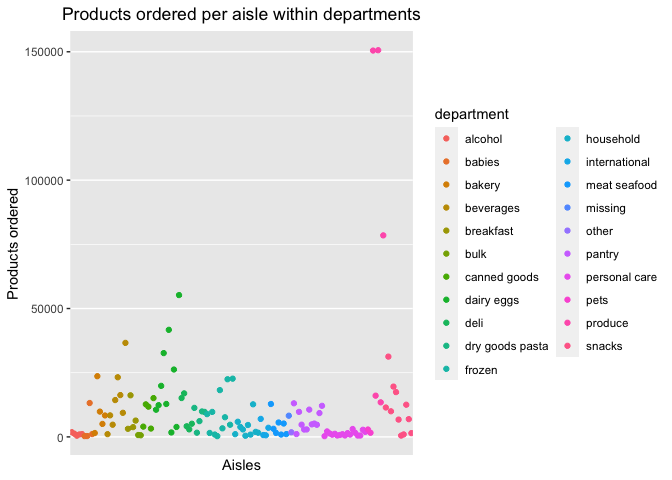

Homework 3
================
Michelle Lee

This is my solution to homework 3.

    library(tidyverse)

    ## ── Attaching packages ─────────────────────────────────────────────── tidyverse 1.3.0 ──

    ## ✓ ggplot2 3.3.2     ✓ purrr   0.3.4
    ## ✓ tibble  3.0.3     ✓ dplyr   1.0.2
    ## ✓ tidyr   1.1.2     ✓ stringr 1.4.0
    ## ✓ readr   1.3.1     ✓ forcats 0.4.0

    ## ── Conflicts ────────────────────────────────────────────────── tidyverse_conflicts() ──
    ## x dplyr::filter() masks stats::filter()
    ## x dplyr::lag()    masks stats::lag()

    library(ggridges)
    library(dplyr)
    library(ggplot2)
    library(p8105.datasets)
    data(instacart)
    names(instacart)

    ##  [1] "order_id"               "product_id"             "add_to_cart_order"     
    ##  [4] "reordered"              "user_id"                "eval_set"              
    ##  [7] "order_number"           "order_dow"              "order_hour_of_day"     
    ## [10] "days_since_prior_order" "product_name"           "aisle_id"              
    ## [13] "department_id"          "aisle"                  "department"

    dim(instacart)

    ## [1] 1384617      15

\[1\] “order\_id” “product\_id”  
\[3\] “add\_to\_cart\_order” “reordered”  
\[5\] “user\_id” “eval\_set”  
\[7\] “order\_number” “order\_dow”  
\[9\] “order\_hour\_of\_day” “days\_since\_prior\_order” \[11\]
“product\_name” “aisle\_id”  
\[13\] “department\_id” “aisle”  
\[15\] “department”

\[1\] 1384617 15 \[1\] 1832

    The data, instacart, shows the order details made on instacart. There are 1384617 rows and 15 variables and some of the key variables are, order_id, product_id, add_to_cart_order,reordered, user_id, eval_set, order_number, order_hour_of_day, days_since_prior_order, product_name, department_id, department. Based on the first set of data, we can infer that order id 1 ordered 8 total items, on the 10th hour of the day, 9 days after its previous order, ordered various items with corresponding aisles, which is in the training set of the evaluation. 

    - How many aisles are there, and which aisles are the most items ordered from?

    ```r
    #number of aisles;
    ins_aisle= 
    instacart %>%
      count(aisle)
      
    ins_aisle

    ## # A tibble: 134 x 2
    ##    aisle                      n
    ##    <chr>                  <int>
    ##  1 air fresheners candles  1067
    ##  2 asian foods             7007
    ##  3 baby accessories         306
    ##  4 baby bath body care      328
    ##  5 baby food formula      13198
    ##  6 bakery desserts         1501
    ##  7 baking ingredients     13088
    ##  8 baking supplies decor   1094
    ##  9 beauty                   287
    ## 10 beers coolers           1839
    ## # … with 124 more rows

    #finding the mode;
    ins_aisle[order(ins_aisle$n,decreasing=TRUE),]

    ## # A tibble: 134 x 2
    ##    aisle                              n
    ##    <chr>                          <int>
    ##  1 fresh vegetables              150609
    ##  2 fresh fruits                  150473
    ##  3 packaged vegetables fruits     78493
    ##  4 yogurt                         55240
    ##  5 packaged cheese                41699
    ##  6 water seltzer sparkling water  36617
    ##  7 milk                           32644
    ##  8 chips pretzels                 31269
    ##  9 soy lactosefree                26240
    ## 10 bread                          23635
    ## # … with 124 more rows

There are 134 aisles and fresh vegetables (n=150609) is the aisle where
the most itemswere ordered from.

-   Make a plot that shows the number of items ordered in each aisle,
    limiting this to aisles with more than 10000 items ordered. Arrange
    aisles sensibly, and organize your plot so others can read it.

<!-- -->

    ins_aisle2 <- ins_aisle[!(ins_aisle$n<10000),]
    ins_aisle2

    ## # A tibble: 39 x 2
    ##    aisle                        n
    ##    <chr>                    <int>
    ##  1 baby food formula        13198
    ##  2 baking ingredients       13088
    ##  3 bread                    23635
    ##  4 butter                   10575
    ##  5 candy chocolate          11453
    ##  6 canned jarred vegetables 12679
    ##  7 canned meals beans       11774
    ##  8 cereal                   16201
    ##  9 chips pretzels           31269
    ## 10 crackers                 19592
    ## # … with 29 more rows

    #bar plot
    #sort in increasing order
    ins_aisle2 <- 
      ins_aisle2[order(ins_aisle2$n,decreasing=FALSE),]
    ins_aisle2

    ## # A tibble: 39 x 2
    ##    aisle                        n
    ##    <chr>                    <int>
    ##  1 butter                   10575
    ##  2 oils vinegars            10620
    ##  3 dry pasta                11298
    ##  4 candy chocolate          11453
    ##  5 canned meals beans       11774
    ##  6 spreads                  12102
    ##  7 cream                    12356
    ##  8 nuts seeds dried fruit   12532
    ##  9 canned jarred vegetables 12679
    ## 10 paper goods              12694
    ## # … with 29 more rows

    ggplot(ins_aisle2,aes(x=reorder(aisle,n), y=n))+geom_bar(stat='identity')+coord_flip()

<!-- --> - Make a table
showing the three most popular items in each of the aisles “baking
ingredients”, “dog food care”, and “packaged vegetables fruits”. Include
the number of times each item is ordered in your table.

    #create a subset;
    popular_items <-
     instacart[which(instacart$aisle == "baking ingredients" |
                    instacart$aisle == "dog food care" |
                    instacart$aisle == "packaged vegetables fruits"),]
    popular_items

    ## # A tibble: 93,193 x 15
    ##    order_id product_id add_to_cart_ord… reordered user_id eval_set order_number
    ##       <int>      <int>            <int>     <int>   <int> <chr>           <int>
    ##  1       36      43086                4         1   79431 train              23
    ##  2       38      18159                2         0   42756 train               6
    ##  3       38      21616                4         1   42756 train               6
    ##  4       96      40706                3         1   17227 train               7
    ##  5       96      27966                5         1   17227 train               7
    ##  6       96      39275                7         1   17227 train               7
    ##  7       98      27966               13         1   56463 train              41
    ##  8       98      18117               30         1   56463 train              41
    ##  9       98      36364               44         0   56463 train              41
    ## 10      112      21174                2         1  125030 train               5
    ## # … with 93,183 more rows, and 8 more variables: order_dow <int>,
    ## #   order_hour_of_day <int>, days_since_prior_order <int>, product_name <chr>,
    ## #   aisle_id <int>, department_id <int>, aisle <chr>, department <chr>

    #drop other columns;
    popular_items=
      select(popular_items, aisle, product_name)
    popular_items

    ## # A tibble: 93,193 x 2
    ##    aisle                      product_name                             
    ##    <chr>                      <chr>                                    
    ##  1 packaged vegetables fruits Super Greens Salad                       
    ##  2 packaged vegetables fruits Organic Biologique Limes                 
    ##  3 packaged vegetables fruits Organic Baby Arugula                     
    ##  4 packaged vegetables fruits Organic Grape Tomatoes                   
    ##  5 packaged vegetables fruits Organic Raspberries                      
    ##  6 packaged vegetables fruits Organic Blueberries                      
    ##  7 packaged vegetables fruits Organic Raspberries                      
    ##  8 baking ingredients         100% Organic Unbleached All-Purpose Flour
    ##  9 baking ingredients         Organic Corn Starch                      
    ## 10 packaged vegetables fruits I Heart Baby Kale                        
    ## # … with 93,183 more rows

    #find frequency of each items;
    popular_items =
    popular_items %>%
      count(aisle,product_name)
    popular_items

    ## # A tibble: 1,444 x 3
    ##    aisle              product_name                                       n
    ##    <chr>              <chr>                                          <int>
    ##  1 baking ingredients "1 to 1 Gluten Free Baking Flour"                 11
    ##  2 baking ingredients "1-to-1 Baking Flour, Gluten/Wheat/Dairy Free"     7
    ##  3 baking ingredients "10\\\" Graham Ready Crust"                        5
    ##  4 baking ingredients "100% Cacao Natural Unsweetened"                   2
    ##  5 baking ingredients "100% Cacao Unsweetened Chocolate Baking Bar"      8
    ##  6 baking ingredients "100% Natural Stevia Sweetener"                    2
    ##  7 baking ingredients "100% Natural Sweetener Zero Calorie Packets"     36
    ##  8 baking ingredients "100% Natural Zero Calorie Sweetener"              4
    ##  9 baking ingredients "100% Organic Einkorn  All-Purpose Flour"          4
    ## 10 baking ingredients "100% Organic Premium Whole Wheat Flour"          11
    ## # … with 1,434 more rows

    #sort in decreasing order;
    popular_items= 
      popular_items[order(popular_items$n,decreasing=TRUE),]
    popular_items

    ## # A tibble: 1,444 x 3
    ##    aisle                      product_name                          n
    ##    <chr>                      <chr>                             <int>
    ##  1 packaged vegetables fruits Organic Baby Spinach               9784
    ##  2 packaged vegetables fruits Organic Raspberries                5546
    ##  3 packaged vegetables fruits Organic Blueberries                4966
    ##  4 packaged vegetables fruits Seedless Red Grapes                4059
    ##  5 packaged vegetables fruits Organic Grape Tomatoes             3823
    ##  6 packaged vegetables fruits Organic Baby Carrots               3597
    ##  7 packaged vegetables fruits Organic Baby Arugula               2923
    ##  8 packaged vegetables fruits Organic Peeled Whole Baby Carrots  2460
    ##  9 packaged vegetables fruits Red Raspberries                    1493
    ## 10 packaged vegetables fruits Clementines, Bag                   1478
    ## # … with 1,434 more rows

    #create a table;
    require(data.table)

    ## Loading required package: data.table

    ## 
    ## Attaching package: 'data.table'

    ## The following objects are masked from 'package:dplyr':
    ## 
    ##     between, first, last

    ## The following object is masked from 'package:purrr':
    ## 
    ##     transpose

    popular_items_top3 = 
    data.table(popular_items, key = "aisle")
    popular_items_top3

    ##                            aisle                             product_name   n
    ##    1:         baking ingredients                        Light Brown Sugar 499
    ##    2:         baking ingredients                         Pure Baking Soda 387
    ##    3:         baking ingredients                               Cane Sugar 336
    ##    4:         baking ingredients       Premium Pure Cane Granulated Sugar 329
    ##    5:         baking ingredients                  Organic Vanilla Extract 327
    ##   ---                                                                        
    ## 1440: packaged vegetables fruits                           Veggie Platter   1
    ## 1441: packaged vegetables fruits                        Very Veggie Blend   1
    ## 1442: packaged vegetables fruits                             White Onions   1
    ## 1443: packaged vegetables fruits                     Whole White Potatoes   1
    ## 1444: packaged vegetables fruits Wild Greens & Quinoa Vegetable Salad Kit   1

    popular_items_top3=
    popular_items_top3[,head(.SD,3), by=aisle]
    popular_items_top3

    ##                         aisle                                  product_name
    ## 1:         baking ingredients                             Light Brown Sugar
    ## 2:         baking ingredients                              Pure Baking Soda
    ## 3:         baking ingredients                                    Cane Sugar
    ## 4:              dog food care Snack Sticks Chicken & Rice Recipe Dog Treats
    ## 5:              dog food care           Organix Chicken & Brown Rice Recipe
    ## 6:              dog food care                            Small Dog Biscuits
    ## 7: packaged vegetables fruits                          Organic Baby Spinach
    ## 8: packaged vegetables fruits                           Organic Raspberries
    ## 9: packaged vegetables fruits                           Organic Blueberries
    ##       n
    ## 1:  499
    ## 2:  387
    ## 3:  336
    ## 4:   30
    ## 5:   28
    ## 6:   26
    ## 7: 9784
    ## 8: 5546
    ## 9: 4966

Make a table showing the mean hour of the day at which Pink Lady Apples
and Coffee Ice Cream are ordered on each day of the week; format this
table for human readers (i.e. produce a 2 x 7 table).

    pla_cic <-
     instacart[which(instacart$product_name == "Pink Lady Apples" |
                    instacart$product_name == "Coffee Ice Cream"),]
    pla_cic

    ## # A tibble: 430 x 15
    ##    order_id product_id add_to_cart_ord… reordered user_id eval_set order_number
    ##       <int>      <int>            <int>     <int>   <int> <chr>           <int>
    ##  1     1342       3798                6         1  156818 train              32
    ##  2    13887      17334                4         1  159168 train               5
    ##  3    32022       3798                3         1   14916 train              46
    ##  4    33963      17334               10         1  180434 train              54
    ##  5    61005       3798                4         1   76283 train              17
    ##  6    63239       3798                6         0   96911 train               5
    ##  7    66981      17334               18         1   27257 train               9
    ##  8    67536       3798                1         1  162096 train               5
    ##  9    76470       3798                5         1  180560 train              61
    ## 10    82073       3798                2         1   76641 train              20
    ## # … with 420 more rows, and 8 more variables: order_dow <int>,
    ## #   order_hour_of_day <int>, days_since_prior_order <int>, product_name <chr>,
    ## #   aisle_id <int>, department_id <int>, aisle <chr>, department <chr>

    #drop other columns;
    pla_cic =
    select(pla_cic , order_hour_of_day, order_dow, product_name)
    pla_cic

    ## # A tibble: 430 x 3
    ##    order_hour_of_day order_dow product_name    
    ##                <int>     <int> <chr>           
    ##  1                 8         3 Pink Lady Apples
    ##  2                17         2 Coffee Ice Cream
    ##  3                13         1 Pink Lady Apples
    ##  4                 9         6 Coffee Ice Cream
    ##  5                 9         2 Pink Lady Apples
    ##  6                 7         4 Pink Lady Apples
    ##  7                 1         6 Coffee Ice Cream
    ##  8                10         2 Pink Lady Apples
    ##  9                 9         1 Pink Lady Apples
    ## 10                 9         1 Pink Lady Apples
    ## # … with 420 more rows

    #group by each dow;
    require(data.table)
    by_dow <- 
    pla_cic %>%
    group_by (order_dow, product_name)
    by_dow

    ## # A tibble: 430 x 3
    ## # Groups:   order_dow, product_name [14]
    ##    order_hour_of_day order_dow product_name    
    ##                <int>     <int> <chr>           
    ##  1                 8         3 Pink Lady Apples
    ##  2                17         2 Coffee Ice Cream
    ##  3                13         1 Pink Lady Apples
    ##  4                 9         6 Coffee Ice Cream
    ##  5                 9         2 Pink Lady Apples
    ##  6                 7         4 Pink Lady Apples
    ##  7                 1         6 Coffee Ice Cream
    ##  8                10         2 Pink Lady Apples
    ##  9                 9         1 Pink Lady Apples
    ## 10                 9         1 Pink Lady Apples
    ## # … with 420 more rows

    by_dow %>% summarise(
      mean_hours = mean(order_hour_of_day)
      )

    ## `summarise()` regrouping output by 'order_dow' (override with `.groups` argument)

    ## # A tibble: 14 x 3
    ## # Groups:   order_dow [7]
    ##    order_dow product_name     mean_hours
    ##        <int> <chr>                 <dbl>
    ##  1         0 Coffee Ice Cream       13.8
    ##  2         0 Pink Lady Apples       13.4
    ##  3         1 Coffee Ice Cream       14.3
    ##  4         1 Pink Lady Apples       11.4
    ##  5         2 Coffee Ice Cream       15.4
    ##  6         2 Pink Lady Apples       11.7
    ##  7         3 Coffee Ice Cream       15.3
    ##  8         3 Pink Lady Apples       14.2
    ##  9         4 Coffee Ice Cream       15.2
    ## 10         4 Pink Lady Apples       11.6
    ## 11         5 Coffee Ice Cream       12.3
    ## 12         5 Pink Lady Apples       12.8
    ## 13         6 Coffee Ice Cream       13.8
    ## 14         6 Pink Lady Apples       11.9

\#problem 3

    library(p8105.datasets)
    data("ny_noaa")
